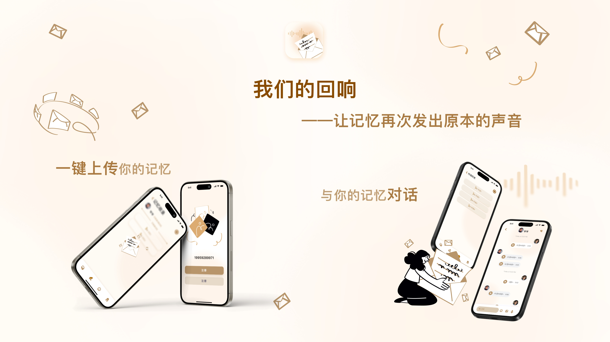
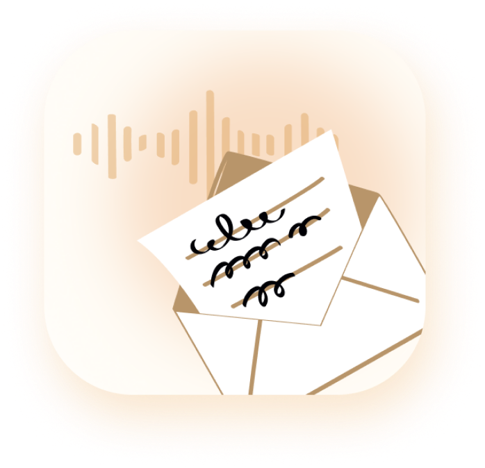

# 我们的回响 Echoes of Us

> “我们不让最珍贵的声音，输给时间。”

### 作品简述

走在科技与人文的十字路口上，记忆再次发出来它原本的声音，跨越时空，你可以和过去任何一个自己对话，和家族的每一段记忆交流。

### 一个时代的叩问：我们正在失去什么？

我们正身处一个信息爆炸的时代。我们用纸笔记录当下的生活，用相机拍下海量的照片，用手机录下无数的视频，我们正在不断尝试记录每时每刻的感受。但与此同时，那些真正宝贵的、塑造了我们的记忆与经验，却正在海量的数据流中，无声地迅速退场……

那些我们历经千险的来时路，那些来之不易的经验、那些充满烟火气的叮嘱、那些闪烁着人生智慧的教诲，注定只能被淡忘吗？

不！我们一定还有方法和他对抗，用科技把他记录下；不止于此，我还要用科技让这些声音，再次粉墨登场，焕发第二次春！让它，再一次去助力，去指引一些年轻，青涩的灵魂。

### 我们的实验：《我们的回响》

为此，我们进行了一场为期三天的、充满敬畏之心的实验——《我们的回响》。我们想探索一个前人从未涉足的领域：**数字化情感与记忆的传承**。我们想知道，科技，能否成为一座让后人随时向过去的记忆交流，请教的桥梁？

我们通过整合声音克隆技术、大语言模型的文本分析与归纳能力，以及 Web 技术，搭建了这座“记忆宫殿”的雏形。

在这里，用户可以：

1. **记录与上传**：轻松录制并上传家人的日常对话、故事、叮嘱，以及独属于自己的感受。
2. **创建智慧分身**：AI 会自动整理这些零散的记忆，并结合声音克隆技术，为每一位创建一个可以对话的“智慧分身”。
3. **开启跨时空对话**：在任何时候，向这些“智慧分身”提问，并亲耳听到他们用自己熟悉的声音，给出充满智慧和情感的回答。

我们保存的，不只是一段记忆，一段熟悉的声音，更是一种自我认同和精神传承。

### 无尽的想象空间

这个实验才刚刚开始，但它打开的想象力是无穷的：

- **未来胶囊**：你可以为 10 年后的孩子，录下一段祝福，让他/她在 18 岁生日那天，亲耳听到你此刻的叮嘱。
- **心灵日记**：你可以为自己创建一个私密的“心灵镜像”，用声音记录每日的成长与困惑还有成就，与过去的自己对话，认可自己的来时路，在低谷时，向过去汲取最纯粹的力量
- **终极愿景**：我们甚至可以想象，东汉末年的孔融，能够打开《我们的回响》，向 2000 多年前的先祖孔子请教：“身处乱世，君子当如何自处？”

### 我们的愿景

我们相信，每一个普通家庭里，都有值得被铭记的“英雄”——那些用一生守护家庭、坚守信念的父辈和祖辈。

我们的愿景，是让每个家庭的欢笑、智慧与美德，都能拥有一个永不消逝的声音。

### 技术栈

- Nuxt 4
- Tailwindcss
- Index TTS
- Kimi API
- Couldflare

### 赛博队员

- Trae
- Cursor
- VScode
- Paraflow
- Gemini Pro
- Augment
- Qwen
- Deepseek
- Doubao
- Kimi
- Arch Linux
- Microsoft Windows
- Bad Apple

## AdvX 相关

### 主题

- All We Do 何以为人

### **赛道（赛道最多不超过 8 个）**

- **光速光合** - 如果记忆能说话，请让我们听到它的声音
- **小红书** - 让 AI 真正进入生活，生活中的每个需求都能被开发者重做一次。
- **Paraflow**
- **Kimi** - 任何使用 Kimi K2 大模型进行 Vibe Coding 开发 或 应用中使用 K2 大模型的项目

### 团队

- 林凯文 - 产品经理 & 主讲人
- 陈汇田 - UI 设计
- 宋海洋 - 全栈
- 苏泓睿 - 全栈

### GitHub

[GitHub Repo](https://github.com/genius-alray/advx-project/)

### **链接**

[Our Echo](https://advx-project.pages.dev)

## 文书问题

### 你想用 AI 做什么？

一个时代独有的现象：我们用手机拍下照片，录下视频的频率变得高，信息迭代变得越来越快，而有些宝贵的记忆与经验在流逝，因不被重视，在无声中退场……

那些可贵的经验，注定只能被遗忘吗？

不！我们一定还有方法和他对抗，留下，用科技把他记录下；不止于此，我还要用科技让这些声音，再次粉墨登场，焕发第二次春！让它，再一次去助力，去指引一些年轻，青涩的灵魂。

为此，为了让这些记忆，经验不被遗忘，让它用原来的声音开口，我们在 AdventureX2025 创造了这个项目（我们的回响）。结合语音转文字技术，大语言模型的文本分析，还有声音克隆技术，这些记忆可以减慢退场的步伐，转身！尝试用他本来的声音去说出他的故事！

在这里，可以记录下父母的声音，用科技接住他们想述说，渴望表达的心；代沟的裂缝，需要更多的交流，促膝长谈，我们愿意用科技去构建一座桥梁，尝试将两代人连接，然后我们想尝试用一座座桥梁，将一整个家族连接。让一个家族的历史用他们本身声音去讲述从何而来，这一路我们然后走来的史诗，相信他一定非常精彩，因为每一个讲述者都是这个故事的演绎者，你，随时可以和他们对话。

同时别忘了，你，也可以是主角，不要压抑你倾述，呐喊的欲望，用你年轻的声音记录下你觉得了不起，有趣的事情。只要开始，就不要停下，一开始我就是希望用这种方式，去纪念我的来时路，同时，我希望可以向那个时候的自己汲取力量。去保留你的记忆，声音，回头看一定会很有价值的。

当然，你还可以用他去做你觉得任何有趣的事，去记录任何一种声音，我们都很好奇，他会和你说什么，我们觉得你的任何一次尝试都是我们的回响最大的价值。
